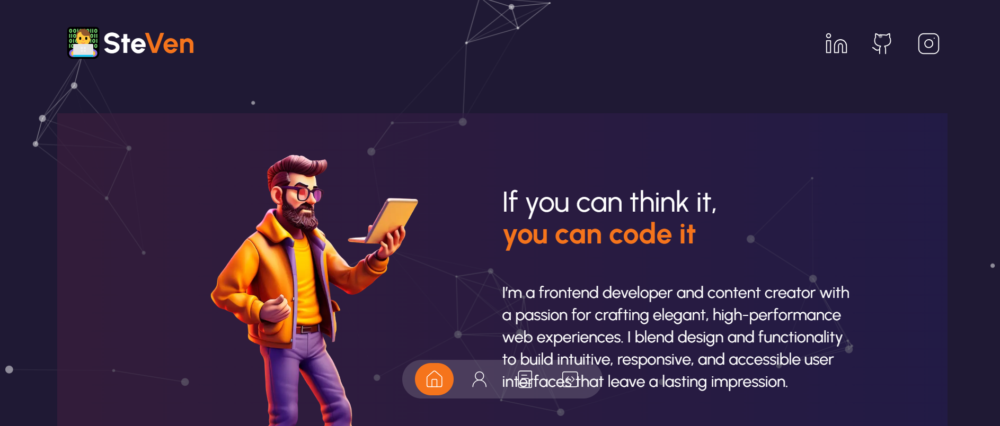

# Portfolio Personal - Steven



Portfolio personal moderno creado con Next.js y TailwindCSS que incluye:

- Fondo animado con partículas (tsparticles)
- Secciones: Home, About Me, Services, Portfolio, Contact
- Diseño responsivo y accesible
- Animaciones suaves y transiciones
- Componentes reutilizables y estructura organizada

---

## Tecnologías usadas

- **Next.js** v14.2.30
- **React** v18
- **TailwindCSS** v3.4.1
- **TypeScript** v5
- **tsparticles** (slim + react) para fondo con partículas
- **framer-motion** para animaciones
- **lucide-react** para íconos SVG
- **react-type-animation** para animación de texto
- **react-countup** para contador animado
- **swiper** para sliders en servicios

---

## Instalación

1. Clona el repositorio

```bash
git clone https://github.com/Steven0319/portfolio-next-tailwind.git
cd portfolio-next-tailwind

2. Instala dependencias

npm install
o yarn install

3. Ejecuta en modo desarrollo

npm run dev
o yarn dev

4.Abre http://localhost:3000 en tu navegador

5. Personalización
-Modifica los colores en tailwind.config.js

-Cambia el contenido en /data para proyectos, experiencia y redes sociales

-Edita componentes en /components para cambiar estilos o funcionalidades

6. Dependencias principales (package.json)

{
  "name": "portfolio",
  "version": "0.1.0",
  "private": true,
  "scripts": {
    "dev": "next dev",
    "build": "next build",
    "start": "next start",
    "lint": "next lint"
  },
  "dependencies": {
    "@tsparticles/react": "^3.0.0",
    "@tsparticles/slim": "^3.8.1",
    "framer-motion": "^12.23.3",
    "lucide-react": "^0.525.0",
    "next": "14.2.30",
    "react": "^18",
    "react-countup": "^6.5.3",
    "react-dom": "^18",
    "react-type-animation": "^3.2.0",
    "swiper": "^11.2.10"
  
  "devDependencies": {
    "@types/node": "^20",
    "@types/react": "^18",
    "@types/react-dom": "^18",
    "eslint": "^8",
    "eslint-config-next": "14.2.30",
    "postcss": "^8",
    "tailwindcss": "^3.4.1",
    "typescript": "^5"

7.Despliegue

Puedes desplegar fácilmente el portfolio en plataformas como Vercel o Netlify, configurando el framework como Next.js y el comando de build next build.

8.Contacto

Email: stevencg.0319@gmail.com